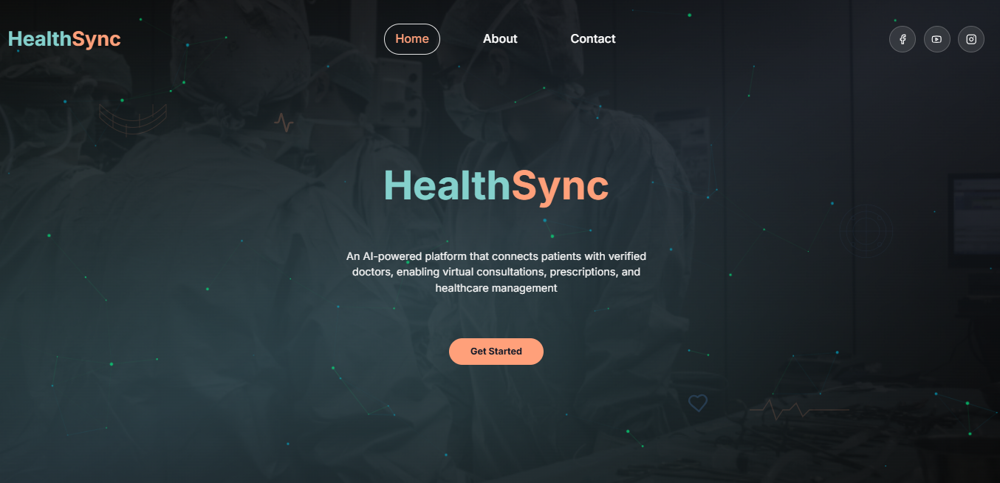

# 🏥 HealthSync – Smarter, Connected Healthcare



**HealthSync** is a full-featured web application designed to transform healthcare delivery by connecting patients and providers through digital innovation. It addresses key healthcare challenges such as fragmented health records, poor medication adherence, and limited diagnostic support by providing an integrated platform with intelligent tools.

At its core, HealthSync enables patients to take control of their health through centralized record management, medication reminders, and symptom tracking. On the other side, healthcare providers gain timely access to patient data, alerts about non-adherence, and AI-powered insights that assist in diagnosis and treatment planning. The platform also serves as an educational hub, helping medical professionals stay informed with trusted resources and updated practices.

---

## 💡 Key Features

- **Digital Health Record Management**: Patients can securely store, access, and share their health records with authorized providers.
- **Medication Adherence Tools**: Reminders and tracking systems help patients stay on schedule with prescriptions, while physicians are alerted about missed doses.
- **AI-Assisted Diagnostics**: Physicians receive automated suggestions based on patient history, potential drug interactions, and AI-driven insights to support decision-making.
- **Symptom & Expense Logging**: Patients can document daily symptoms and healthcare-related costs for better self-management and informed consultations.
- **Provider Resource Center**: A curated space with updated medical guidelines and resources to support ongoing professional development.

---

## 🧰 Tech Stack

| Tech               | Role                                          |
|--------------------|-----------------------------------------------|
| **React.js**       | Core frontend framework                       |
| **Vite**           | Lightning-fast development & build tooling   |
| **Tailwind CSS**   | Utility-first styling for responsive UI       |
| **TypeScript**     | Type-safe components and data structures      |
| **Firebase**       | Authentication, Firestore DB, Hosting         |
| **OpenAI / ML**    | AI tools for diagnostics and interaction      |

---

## ⚙️ Getting Started

Follow these steps to run the project locally:

```bash
# Clone the repository
git clone https://github.com/Epyuel/HealthSync-frontend.git
cd HealthSync-frontend

# Install dependencies
npm install

# Run the development server
npm run dev
